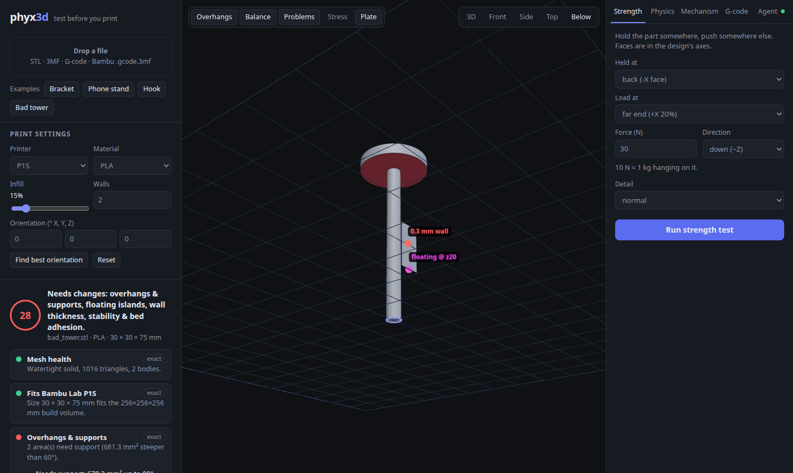
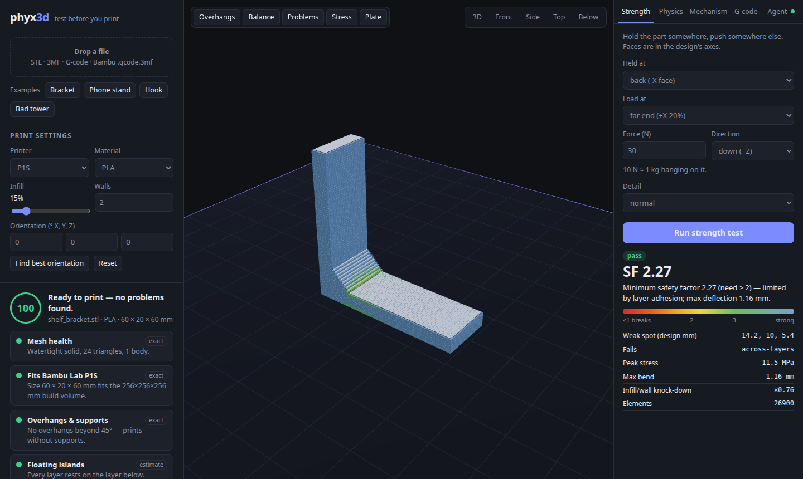
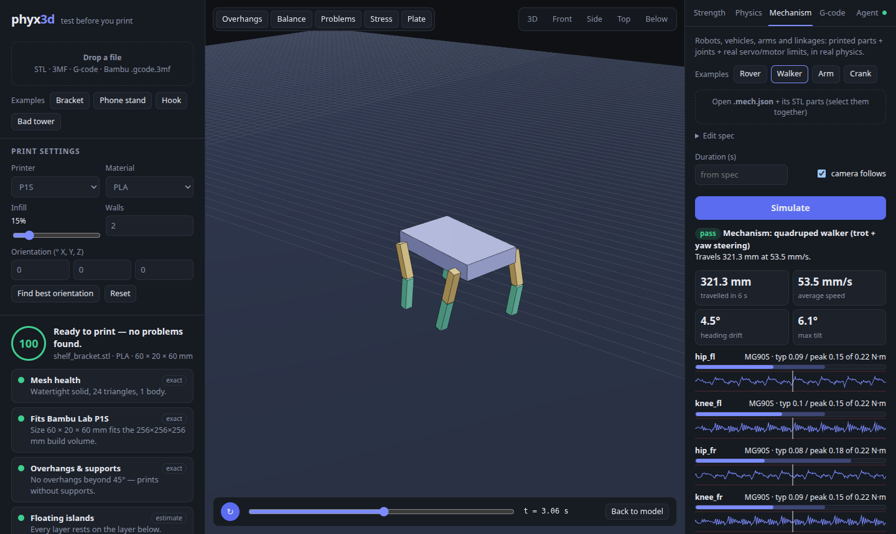
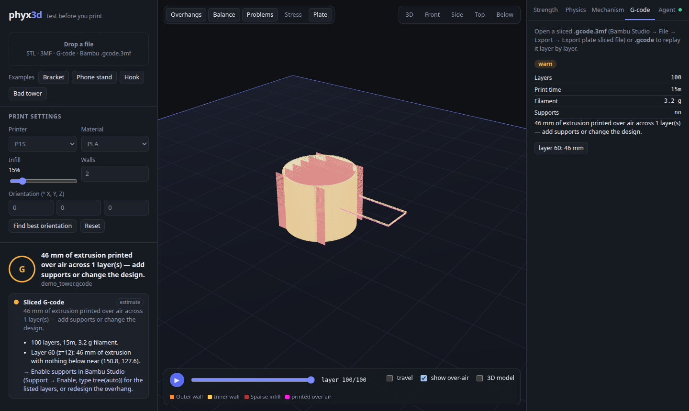
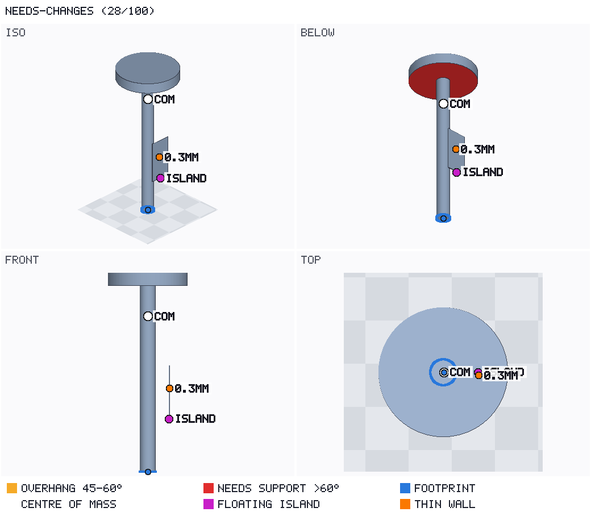
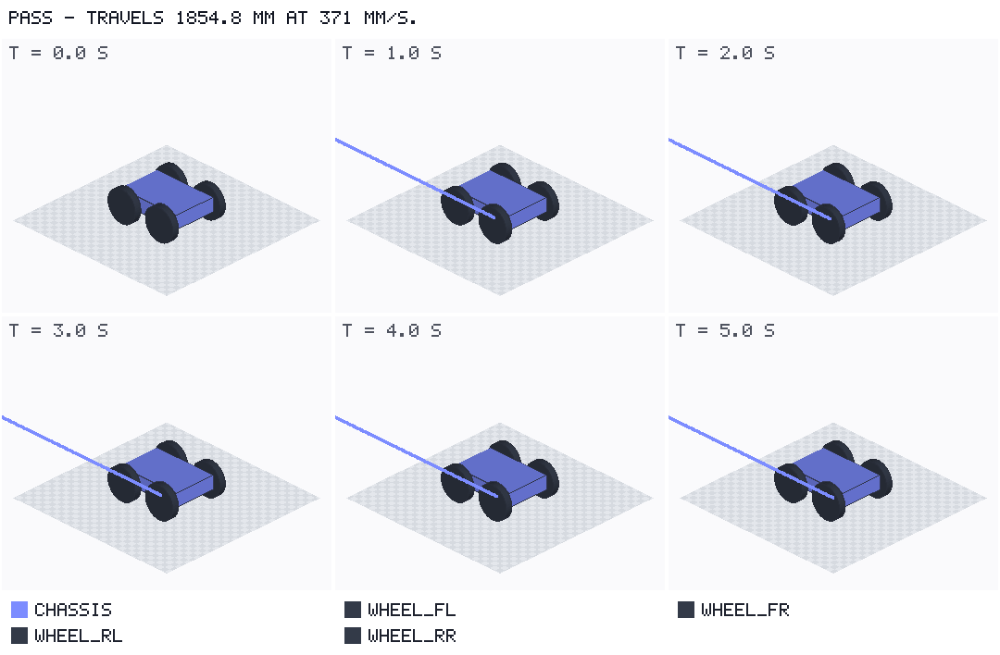
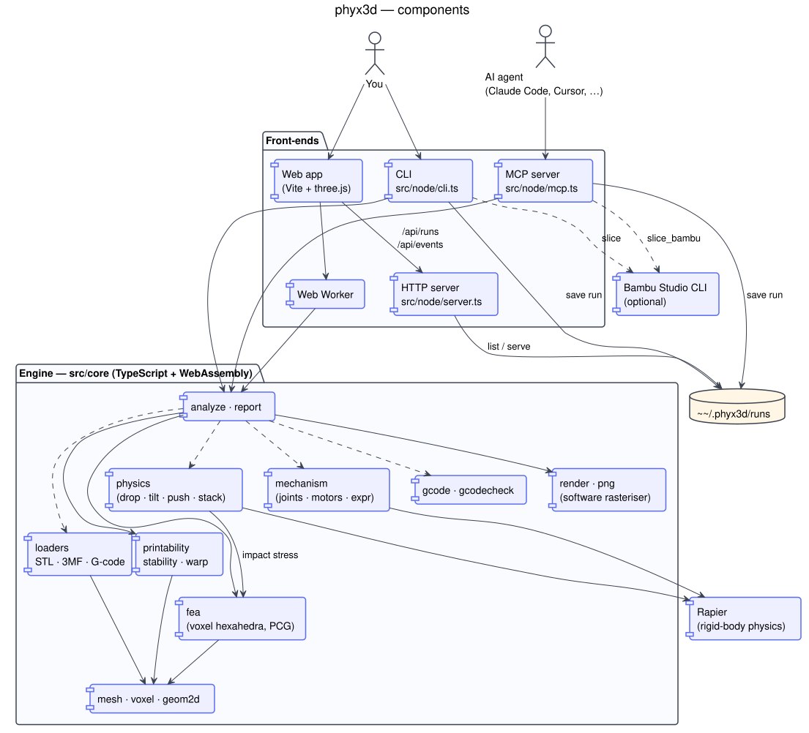

# phyx3d

**Test your 3D prints before you print them — and let AI agents do it for you.**

[](https://www.npmjs.com/package/phyx3d)
[](https://www.npmjs.com/package/phyx3d)
[](https://github.com/arielmiki/phyx3d/actions/workflows/ci.yml)
[](LICENSE)


phyx3d checks a 3D model (STL, 3MF, or a sliced Bambu Studio `.gcode.3mf`) for the things that make prints fail
or break — overhangs, floating parts, thin walls, tipping over, weak spots under load — and simulates how the
printed part behaves in the real world: dropped, tilted, pushed, stacked, or moving as part of a robot or machine.

It works three ways, all from the same engine:

| | Interface | Good for |
|---|---|---|
| 🖥 | **Web app** (`phyx3d serve`) | Looking at problems in 3D, strength maps, physics & robot replays, G-code layer replay |
| 🤖 | **MCP server** (`phyx3d-mcp`) | Letting Claude Code / Claude Desktop / Cursor design → test → fix parts on their own |
| ⌨️ | **CLI** (`phyx3d check part.stl --json`) | Scripts and CI: JSON reports, PNG pictures, non-zero exit when a part needs changes |

Made with Bambu Lab printers in mind (P1S / P1P / P2S / X1C / A1 / A1 mini / H2D presets), but the checks apply to
any FDM printer.

<p align="center">
  
  
  
  
</p>

## What it checks

| Check | How | How far to trust it |
|---|---|---|
| Mesh health — holes, flipped faces, separate bodies | edge topology | exact |
| Fits the build plate | bounding box vs. printer volume | exact |
| Overhangs & supports (Bambu's 30° threshold); bridges vs. cantilevers | face normals + voxel support test | exact |
| Floating islands (regions that start in mid-air) | layer-by-layer voxels | estimate |
| Thin walls (< nozzle = missing, < 2 lines = weak) | BVH ray casting | estimate |
| Stability — centre of mass, tip angle, bed contact, wobble while printing | mass properties + support polygon | estimate |
| Warp risk | material, footprint, corners, enclosure | rough guide |
| Strength under load, **including weak layer bonds** | voxel finite-element solver (8-node hexahedra, PCG) | rough guide |
| Drop / tilt / push / stack tests | Rapier rigid-body physics with printed mass & friction | simulated |
| **Mechanisms** — does the robot walk, the car drive, the arm lift, the linkage move? | multi-body physics, joints, real servo/motor torque & speed limits | simulated |
| Best print orientation | ranks candidate orientations by supports, islands, stability, warp, height | estimate |
| Sliced G-code: time, filament, extrusion printed over air | toolpath parser | exact |
| Slice with Bambu Studio (optional) | Bambu Studio command line | exact |

Every result says how far to trust it. The solvers are validated against textbook cases in the test suite:
cantilever beam deflection (within 2 %) and stress (within 6 %), tip and slide angles, rover speed vs. wheel rpm,
crank-slider stroke, and servo holding torque = m·g·r. **Strength results are guidance, not certified engineering.**

## Quick start

Requires **Node.js 20 or newer**.

```bash
npx phyx3d serve                  # web app → http://localhost:5217, nothing to install
```

or install the `phyx3d` command:

```bash
npm install -g phyx3d
```

The latest code from GitHub works the same way: `npx -y github:arielmiki/phyx3d serve` (it builds on first run).

Try it without your own models: the web app has example parts (bracket, phone stand, hook, a deliberately bad
tower) and example mechanisms (rover, walking robot, robot arm, crank-slider).

### Command line

```bash
phyx3d check part.stl -m PETG --png report.png     # all printability checks + picture
phyx3d orient part.stl                             # best print orientations
phyx3d stress bracket.stl --fixed -x --force "rel:0.8,0,0:1,1,1=0,0,-50"
phyx3d drop part.stl --height 750 --floor wood     # also: tilt, push, stack
phyx3d mech robot.mech.json --png walk.png         # robots & mechanisms
phyx3d gcode plate_1.gcode.3mf
phyx3d serve                                       # web app
phyx3d materials                                   # material presets
phyx3d --help                                      # everything else
```

Add `--json` to any command for machine-readable output. `check` exits with code 2 when the part needs changes,
so you can use it in CI.

Regions for `--fixed` / `--force`: `bottom|top|-x|+x|-y|+y`, `box:x0,y0,z0:x1,y1,z1`, `sphere:x,y,z:r`, or
`rel:fx0,fy0,fz0:fx1,fy1,fz1` (fractions of the part's size — usually the easiest).

**Coordinates:** an unrotated model resting on z = 0 is reported in its own CAD coordinates. Strength tests always
use the design's axes; testing a different print orientation only changes which way the layers run.

## Use it with an AI agent (MCP)

The MCP server gives an agent these tools: `analyze_model`, `suggest_orientation`, `stress_test`,
`simulate_physics`, `simulate_mechanism`, `render_view`, `check_gcode`, `slice_bambu`, `list_materials`.
Results come back as JSON **plus a picture**, so the agent can see what is wrong.

Register the server — no clone or build needed:

**Claude Code**

```bash
claude mcp add --scope user phyx3d -- npx -y phyx3d mcp
```

**Claude Desktop** (`claude_desktop_config.json`) / **Cursor** (`~/.cursor/mcp.json`) / other MCP clients

```json
{
  "mcpServers": {
    "phyx3d": { "command": "npx", "args": ["-y", "phyx3d", "mcp"] }
  }
}
```

If you installed it globally, `phyx3d mcp` works as the command too.

For the full *design → test → fix* loop, pair it with a CAD MCP server such as
[build123d-mcp](https://github.com/pzfreo/build123d-mcp) (Python CAD) and install the included skill, which teaches
the agent the workflow (modelling rules, which checks to run, how to report):

```bash
claude mcp add --scope user build123d -- uv tool run --python 3.12 build123d-mcp@latest
npx phyx3d install-skill        # copies the print-design skill to ~/.claude/skills
```

Then ask, for example: *"Design a wall hook that holds a 1 kg bag, in PLA, and make sure it prints on my P1S"* or
*"Design a two-wheeled robot car with N20 motors and check that it drives straight."*

<p align="center">
  
  
</p>

Keep `phyx3d serve` open while the agent works: every check it runs appears live in the web app's **Agent** tab.
Runs are stored in `~/.phyx3d/runs/` (override with `PHYX3D_HOME`).

## Mechanisms: robots, vehicles, arms, linkages

A `.mech.json` file lists parts, joints and motors. Parts can be STL files (modelled in their assembled position)
or quick primitives. Motors use real presets with their torque and speed limits.

```json
{
  "name": "robot arm", "duration": 4,
  "parts": [
    { "id": "base", "file": "base.stl", "fixed": true },
    { "id": "arm",  "file": "arm.stl", "payloads": [{ "mass": 100, "at": [120, 0, 60] }] }
  ],
  "joints": [
    { "id": "shoulder", "type": "revolute", "parent": "base", "child": "arm",
      "anchor": [0, 0, 60], "axis": [0, -1, 0], "limits": [-10, 120],
      "motor": { "preset": "MG996R", "target": "45*sin(2*pi*0.5*t)" } }
  ]
}
```

You get: distance, speed, heading drift and whether it falls over; each motor's typical and peak torque against its
rating, how often it hits its limit and how far it lags; parts that collide or overlap; joint ranges; a filmstrip
picture; and a 3D replay in the web app. See **[docs/MECHANISMS.md](docs/MECHANISMS.md)** for the full format and
[`examples/mechanisms/`](examples/mechanisms) for working examples.

## Slicing with Bambu Studio (optional)

`phyx3d slice part.stl` runs the real Bambu Studio command line and returns the `.gcode.3mf` with exact print time,
filament use and an over-air check. It never starts a print.

1. Install Bambu Studio (AppImage from the [releases page](https://github.com/bambulab/BambuStudio/releases),
   flatpak `com.bambulab.BambuStudio`, or the macOS/Windows app). phyx3d looks on `PATH`, in `~/Applications`,
   `~/Downloads`, flatpak, or `PHYX3D_BAMBU_STUDIO=/path/to/app`.
2. Export your printer, process and filament presets from Bambu Studio and save them as
   `~/.phyx3d/profiles/machine.json`, `process.json` and `filament.json` — or slice a `.3mf` project saved from
   Bambu Studio, which carries its own settings.

This integration is the least-tested part of phyx3d; reports and fixes are very welcome.

## Limitations

- Strength uses isotropic stiffness with separate along-layer / across-layer strength limits and a simple
  wall/infill knock-down. Treat safety factors as a comparison tool, not a certificate.
- Warp risk is a heuristic score, not a thermal simulation.
- Mechanism motors are torque-limited controllers with estimated gearbox inertia; gear and bearing friction,
  backlash, servo electronics and battery sag are not modelled — keep roughly 30 % torque margin.
- Material values are typical datasheet numbers; real filaments vary by brand, colour and print settings.
- Tested on Linux with Node 22. macOS and Windows should work (pure TypeScript + WebAssembly) but are less tested.

## How it works

The engine in `src/core` is plain TypeScript with no native dependencies, so the same code runs in Node (CLI, MCP
server) and in the browser (web app, inside a Web Worker). See **[docs/ARCHITECTURE.md](docs/ARCHITECTURE.md)**.



```
src/core/     engine: loaders, mesh & voxel geometry, printability, stability, warp, FEA, physics,
              mechanisms, G-code, software renderer (PNG), analysis & reports
src/node/     cli.ts, mcp.ts (MCP server), server.ts (web app + run history), slice.ts (Bambu Studio)
web/          Vite + three.js app
skills/       print-design skill for Claude Code
examples/     example parts, build123d scripts and mechanisms
test/         vitest suites, including physics / FEA / mechanism validation
```

## Contributing

Bug reports, printer and material presets, validation cases against real prints, and pull requests are welcome —
see [CONTRIBUTING.md](CONTRIBUTING.md). Working from a clone:

```bash
git clone https://github.com/arielmiki/phyx3d.git && cd phyx3d
npm install         # also builds dist/
npm link            # puts your local build on PATH as `phyx3d`
npm test
```

## License & credits

MIT — see [LICENSE](LICENSE).

Built on [three.js](https://threejs.org), [three-mesh-bvh](https://github.com/gkjohnson/three-mesh-bvh),
[Rapier](https://rapier.rs) (Apache-2.0), [fflate](https://github.com/101arrowz/fflate),
the [Model Context Protocol SDK](https://github.com/modelcontextprotocol/typescript-sdk), [zod](https://zod.dev)
and [commander](https://github.com/tj/commander.js).

phyx3d is an independent project and is not affiliated with or endorsed by Bambu Lab. "Bambu Lab" and
"Bambu Studio" are trademarks of their respective owner.
