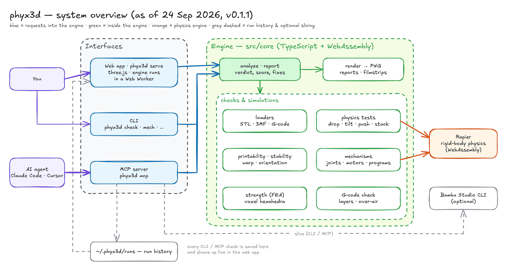
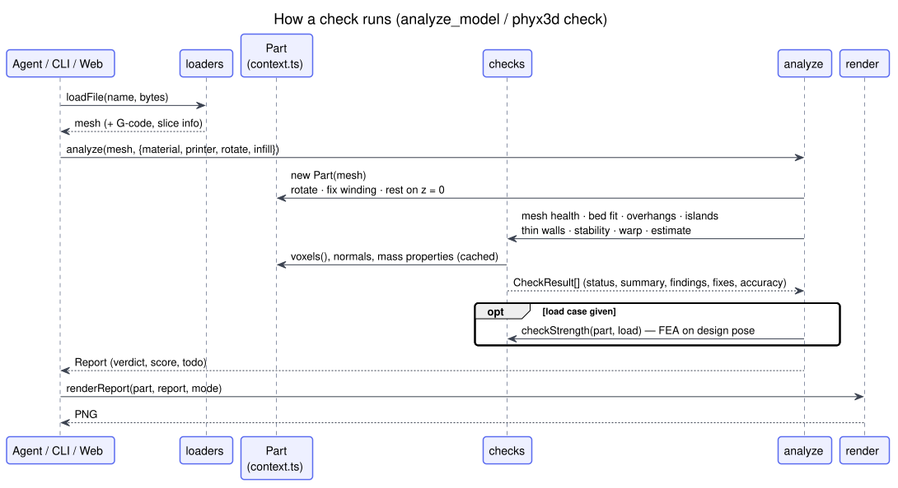
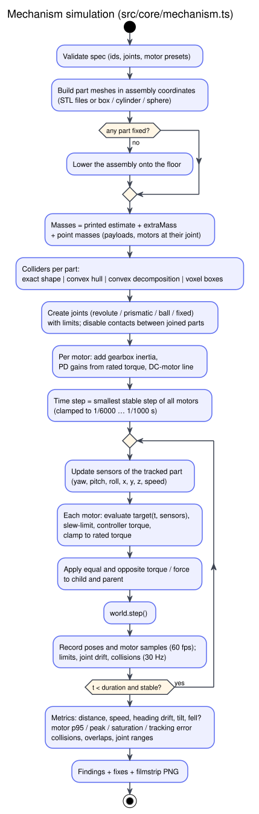

# Architecture

phyx3d is one TypeScript engine with three front-ends.

The system overview is an Excalidraw drawing, committed as its exported PNG. The sequence, activity and class
diagrams below are PlantUML: sources in [`docs/diagrams/`](diagrams) (`*.puml`), regenerate the SVGs with
`plantuml -tsvg -failfast2 docs/diagrams/*.puml`.

## Core modules (`src/core`)

| Module | What it does |
|---|---|
| `mesh.ts` | Indexed triangle mesh, welding, bounding box, mass properties (divergence theorem), mesh health, transforms, primitives |
| `loaders.ts` | STL (binary/ASCII), 3MF incl. Bambu projects (components + transforms), Bambu `.gcode.3mf` (plate G-code + `slice_info.config`) |
| `context.ts` | `Part`: a mesh in print pose (rotated, resting on z = 0) plus its design pose, material, printer, settings and cached voxels |
| `voxel.ts` | Solid voxelisation by vertical ray parity (Z columns = print layers), per-layer stats, floating-island detection, greedy box merging |
| `printability.ts` | Mesh health, bed fit, overhang clusters (bridge vs. cantilever via voxel support test), islands, BVH thin-wall rays, estimates |
| `stability.ts` | Footprint / support polygon, centre of mass, tip angle, height-to-base ratio, per-layer slenderness, "printed-so-far" lean |
| `warp.ts` | Heuristic warp-risk score |
| `fea.ts`, `mg.ts` | Linear-elastic FEA on voxels: 8-node hexahedra, matrix-free CG with a geometric-multigrid preconditioner, stresses at Gauss points, along-layer vs. across-layer failure using the build direction; force, acceleration and prescribed-displacement loads (with reaction forces) |
| `physics.ts` | Rapier rigid-body scenarios: drop (with impact → FEA), tilt, push, stack |
| `mechanism.ts` | Multi-body simulation from a `.mech.json`: joints, motor presets, explicit torque controllers with gearbox inertia, adaptive time step, metrics |
| `interlock.ts` | Interlocking parts: type → motion family, assembly-path sweeps with BVH mesh-vs-mesh collision (three-mesh-bvh), fit, escapes and free play, catch engagement, press-fit interference, wrong-way assembly. See [INTERLOCKS.md](INTERLOCKS.md) |
| `expr.ts` | Safe expression compiler (Pratt parser, no `eval`) for motion programs, with live sensor variables |
| `gcode.ts`, `gcodecheck.ts` | Toolpath parser (G0/G1/G2/G3, relative/absolute E, Bambu/Orca/Prusa feature comments) and over-air extrusion scan |
| `render.ts`, `png.ts` | Headless software rasteriser → PNG (for agents and CI), with overlays, legends and filmstrips |
| `analyze.ts` | Runs all checks, scores, builds the report, renders report pictures, searches print orientations |

## How a check runs

Every check returns the same `CheckResult` shape — `status` (pass / warn / fail / info), a one-line `summary`,
`findings` with positions in mm, concrete `fixes`, an `accuracy` label and check-specific `data` — so the web app, CLI
and MCP server can all present any check the same way.

## Mechanism simulation

`simulateMechanism(spec, resolveFile)` builds one Rapier rigid body per part (body frame = assembly frame at t = 0,
so joint anchors and axes are identical in both bodies), creates impulse joints, and drives motors with explicit
torques each step:

- **Servo (position mode):** the command is slew-limited to the servo's rated speed, then a PD controller with
  velocity feed-forward computes the torque, clamped to the rated torque.
- **Gearmotor (velocity mode):** torque follows the DC-motor line — stall torque at 0 rpm, zero at no-load speed.
- **Gearbox inertia:** each motor adds the reflected rotor inertia (rated torque × 30 ms ÷ rated speed) to the
  driven part about the joint axis. Real hobby servos are dominated by it, and it keeps light links stable.
- **Time step:** the smallest stable step over all motors (from the reduced inertia seen across each joint),
  clamped to 1/6000 … 1/1000 s.
- **Measurements:** poses and motor samples at 60 fps; limits, joint drift and part-to-part contacts at 30 Hz; the
  first step also detects parts that overlap in the starting pose.

The file format and every field are described in [MECHANISMS.md](MECHANISMS.md).

## Units and coordinates

Millimetres, grams, seconds; Z is up (the build direction). Physics runs in the same units (Rapier's `lengthUnit`
is set to 1000 per metre), so torques inside the engine are g·mm²/s² (= 1e-9 N·m) and are converted for reports.

`Part.mesh` is the print pose; `Part.designMesh` is the model as designed. Strength tests run on the design pose
and use `Part.buildDir` (the build direction in design coordinates), so loads stay attached to the design whatever
the print orientation.

## Why some things are done the way they are

- **Voxels for layer questions.** Islands, per-layer centre of mass and FEA all want a regular grid aligned with
  the layers; parity voxelisation is simple and robust for watertight meshes.
- **Explicit motor torques.** Rapier's built-in joint motors did not match their documented stiffness units, and
  their applied impulse cannot be read back. phyx3d applies motor torques itself, so reported torques are exactly
  what was applied. Very light printed links would make that unstable, so each motor adds its gearbox's reflected
  inertia (estimated from rated torque and speed) and the time step adapts to the stiffest joint.
- **Touching is not overlapping.** Printed parts that rest on each other share faces exactly, and exact collision
  would call that an overlap. The interlock sweep counts a pose as overlapping only if nudging the part a hair in
  every direction still leaves the surfaces crossing, and it skips parallel faces lying on each other. Each stop is
  then re-found with a 20× finer nudge, so free play reads to about 0.01 mm.
- **Multigrid, not just Jacobi.** Jacobi-preconditioned CG needs thousands of iterations on thin or slender
  parts, because the error left over is smooth across the whole part and Jacobi only damps error at the element
  scale. A V-cycle on a stack of grids, each merging 2 × 2 × 2 elements, removes that error. Coarse levels are
  re-discretised: a coarse element's stiffness is scaled by the share of it that is solid. The damped-Jacobi
  smoother's weight comes from each level's measured largest eigenvalue, because one-voxel-thick walls push
  that eigenvalue far above a solid block's and a fixed weight diverges. Typical cases converge in 20–600
  iterations instead of 400–10 000.
- **Only faces join elements.** Voxels that touch only at an edge or corner are hinges. They make the stiffness
  matrix singular, and the "deflection" runs to 10¹⁰ mm. So elements join through shared faces, and an element
  counts as held only when at least 3 of its nodes are fixed. When that leaves too little of the part (thin
  walls turn into edge-touching voxel chains), the grid is refined until the connected model holds the part's
  volume.
- **Say when a result can't be trusted.** A strength result is marked unreliable, and neither passes nor fails
  the part, in any of these cases: the solver didn't converge; the grid misses more than 20 % of the part; or
  the part bends more than 10 % of its size, which is beyond linear theory.
- **Impacts on flexible parts.** The rigid estimate of an impact's peak deceleration (velocity change ÷ contact
  time) assumes the whole part stops as fast as the point that hits. The contact time is lengthened for soft
  materials (∝ √(E_rigid / E)). After the stress solve, the part is also treated as a spring of the stiffness
  the solve measured, whose peak force is v·√(k·m), and the lower of the two estimates is used. Flexible
  materials (E < 200 MPa, e.g. TPU) aren't judged against tensile strength at all: they bend instead of
  breaking.
- **Thin walls are parallel faces.** The wall-thickness rays count only when the far face roughly faces back
  (within 30°). A ray that meets the far face at a grazing angle started beside a corner or a chamfered edge,
  so it measures that corner, not a wall. Each region reports a low percentile of its samples, not its single
  thinnest ray.
- **Displacement loads for snaps.** A snap arm always bends by the same distance, so the strength test holds the
  pushed nodes at that displacement, moves the known part to the right-hand side, and reads the push force back
  as the reaction.
- **A software renderer.** Agents and CI machines rarely have a GPU; a small rasteriser makes report pictures
  anywhere.

## Web app (`web/`)

Vite + three.js. All analysis runs in `web/src/worker.ts` using the same `src/core` code. `server.ts` serves the
built app and the run history (`/api/runs`, plus server-sent events on `/api/events` for live updates).
