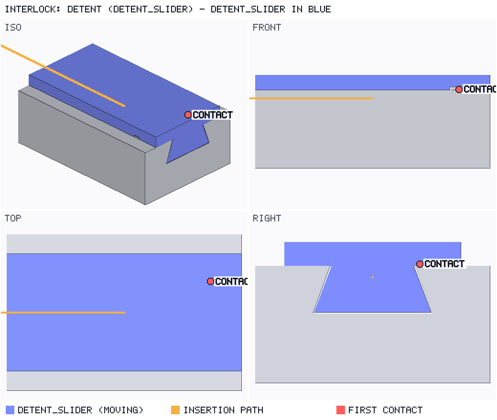
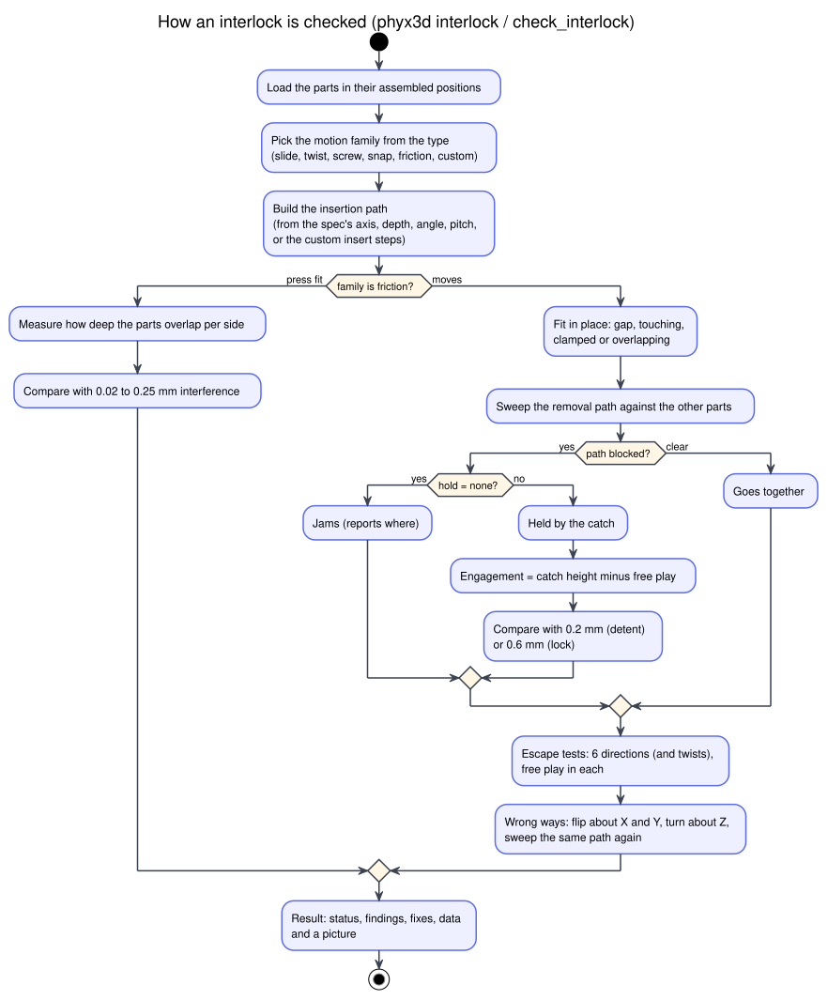

# Interlocking parts (`.interlock.json`)

Parts that lock together are where printed designs most often go wrong. Common failures:
- a dovetail that binds;
- a bayonet lug that hits the socket half-way round;
- a detent too small to hold after the play is taken up;
- a lid that also fits the wrong way round.

`phyx3d interlock` tests all of these on the real meshes before you print.

It is an optional check: `phyx3d check` does not run it. Run it with `phyx3d interlock`, or from an agent with the
MCP tool `check_interlock`.



## Quick use

Give the fixed part(s) first and the moving part last, both **modelled in their assembled position**:

```bash
phyx3d interlock rail.stl slider.stl --type dovetail --axis 1,0,0
phyx3d interlock socket.stl cap.stl --type bayonet --axis 0,0,-1 --depth 6 --angle -30 --center 0,0,0
phyx3d interlock enclosure.interlock.json --png lock.png     # several interlocks in one file
```

`--axis` is the direction the moving part travels to go **in**. The command exits with code 2 if any interlock fails.

## What it checks



| Check | What you learn |
|---|---|
| **Fit in place** | For each part it touches, one of four results: a gap (mm); *touching* (resting on a face, fine); *clamped* (zero clearance on opposite sides, so it binds or fuses); or *overlapping* (both can't exist there). |
| **Assembly path** | The moving part is swept back out along its path with exact mesh collision. Result: *goes together*, *jams* (where, and how far from home), or *held* (something stops it coming out, which is what you want for a lock). |
| **Escapes and free play** | It tries to move the part 6 ways, plus twisting both ways for twist types. Each direction reports free (nothing stops it) or blocked after N mm. It warns about any free direction other than the way it came in. |
| **Engagement** (detents, locks) | The height of the catch along the direction it has to flex, minus the free play in that direction. Needs at least 0.2 mm (detent) or 0.6 mm (lock), and the catch should be a whole number of layers. |
| **Press-fit interference** | How deep the parts overlap per side. Aim for 0.02–0.25 mm. Too much splits the part along its layers; too little comes out loose. |
| **Wrong ways** | The moving part is flipped about X, flipped about Y and turned about Z, then pushed along the same path. A flip that still goes together is a warning. A flip that gives the same shape (a symmetric part) doesn't count. |

Every result gives a location, and each problem comes with a fix. The picture shows the moving part in blue, its
insertion path in orange and the first contact in red.

**Accuracy.** Collision is exact on the triangle meshes. Distances are found by sampling (0.1 mm and 1° by
default) and then refined, so free play and contact distances are good to about ±0.01 mm. Curved surfaces are
exported as flat facets, so on a round hole the error is the facet error, typically 0.01–0.02 mm. Export
curved parts finely. The check is geometry only: it does not know how much the plastic flexes. For that, see
[Snap and detent strength](#snap-and-detent-strength).

## Spec file

```json
{
  "name": "pi enclosure",
  "layerHeight": 0.2,
  "parts": [
    { "id": "base", "file": "base.stl" },
    { "id": "lid",  "file": "lid.stl" },
    { "id": "door", "file": "door.stl", "position": [0, 0, 2] }
  ],
  "interlocks": [
    { "name": "lid slides on", "type": "dovetail", "moving": "lid", "against": ["base"], "axis": [1, 0, 0] },
    { "name": "lid click",     "type": "detent",   "moving": "lid", "against": ["base"], "axis": [1, 0, 0] },
    { "name": "door twist",    "type": "bayonet",  "moving": "door", "axis": [0, 0, -1], "depth": 4, "angle": 30, "center": [40, 30, 0] }
  ]
}
```

Units are mm and degrees. Part `file` paths are relative to the spec. Parts take the same `file` / `shape` /
`position` / `rotation` fields as [mechanism parts](MECHANISMS.md#parts).

| Interlock field | Default | Meaning |
|---|---|---|
| `name` | type + moving part | Shown in reports |
| `type` | `custom` | One of the types below; case, spaces and endings like "joint", "fit" or "lock" don't matter |
| `moving` | — | Id of the part that moves to assemble |
| `against` | all other parts | Parts it must fit against |
| `axis` | — | Direction it travels to go **in** (slide, snap, push). For twist and screw types, the turning axis (pointing in) |
| `travel` | its length along `axis` + 2 mm | How far it slides in |
| `depth` | 5 | Twist types: how far it pushes in before turning |
| `angle` | type's angle (30°, 90° for quarter-turn) | Twist angle; the sign sets the direction (right-hand rule about `axis`) |
| `center` | the moving part's centre | A point on the turning axis |
| `pitch`, `turns` | — | Screw types: thread pitch (mm) and turns to seat |
| `drop`, `slide` | — | Keyhole: drop in along `axis` by `drop`, then slide by the `slide` vector |
| `insert` | from the fields above | A custom path, as a list of steps: `{move: [x,y,z]}`, `{rotate: deg, axis, about}`, `{screw: deg, pitch, axis, about}`. It must end in the assembled position |
| `hold` | from the type | What should keep it together: `lock`, `detent` or `none`. With `none`, the path must be clear |
| `clearance` | from the type | Designed gap `[min, max]` in mm. Press fits use a negative gap, which is interference |
| `wrongWays` | `true` | Set to `false` to skip the wrong-way check |

Top level: `layerHeight` (0.2) is used for the catch-size check. `step` (0.1 mm) and `angleStep` (1°) set the
sampling.

## Types

Every interlock is one of six motions, so every type is checked as one of these families:

| Family | How it is checked | Types |
|---|---|---|
| **slide** (push or slide along one direction) | path along `axis`; must be clear | dovetail, t-slot, t-track, t-key, trapezoidal-slide, l-key, l-slot, v-groove, v-key, spline, tongue-and-groove, finger-slide, keyed-slide, puzzle-lock, mortise-and-tenon, finger-joint, box-joint, scarf-joint, lap-joint, half-lap, bridle-joint, cross-lap, comb-joint, key-and-slot, jigsaw, star-interlock, cross-interlock, z-lock, s-lock, dovetail-puzzle, pin-and-hole, clevis-and-pin, spline-coupling, gear-coupling, dog-clutch, hirth, keyhole (drop + slide) |
| **twist** | push in by `depth`, then turn by `angle`; the default hold is detent | bayonet, quarter-turn, quarter-turn-tab, twist-lock, cam-lock, rotary-dovetail, mousetrap-lock, interlocking ring |
| **screw** | turn and advance together (`pitch`, `turns`) | thread, helical |
| **snap** | slide in along `axis`; something must stop it coming out, with enough engagement | detent, ball-snap, spring-tab (hold detent); cantilever-snap, annular-snap, torsional-snap, u-clip, hook-and-latch, barbed-snap, ball-and-socket (hold lock) |
| **friction** | interference per side in the assembled pose | press-fit, friction-lock, wedge-lock, collet, self-locking-polygon |
| **custom** | your `insert` path | custom |

Snap types are checked as rigid geometry. The catch must stop the part, and the engagement must survive the free
play. Whether the arm can bend that far without breaking is a strength question.

## Snap and detent strength

A snap arm or detent always bends by the same distance, whatever force that takes. So test it by displacement,
not by guessing a force:

```bash
# hold the root of the arm, push the barb up by the catch height the interlock check reported
phyx3d stress latch.stl --fixed "rel:0,0,0:0.1,1,1" --move "rel:0.9,0,0:1,1,1=0,0,0.6" --elements 60000
```

This gives the safety factor at that deflection and the force it takes to push, in newtons, which tells you
whether it is easy to press. From an agent, use `stress_test` with
`displacements: [{region, move: [dx, dy, dz]}]`. Only the axes you move are held, so the part can still slide
sideways. Use a fine mesh (≥ 60 000 elements) for thin arms, and print snap arms flat on the bed so they bend
along the layers.
