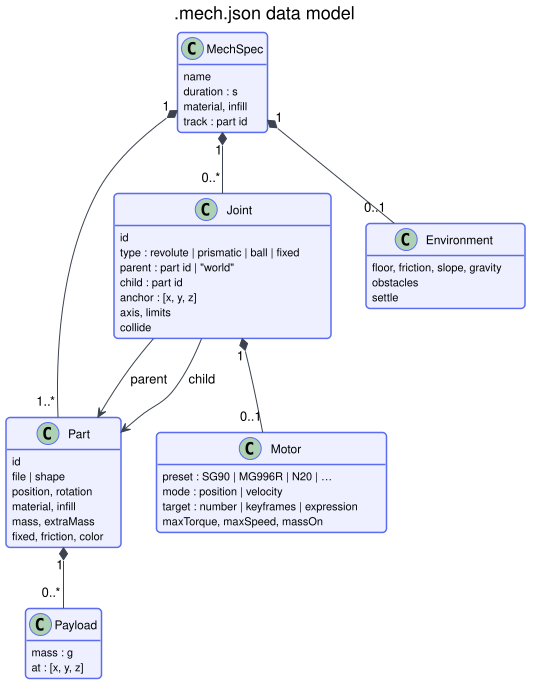

# Mechanism files (`.mech.json`)

A mechanism is a set of rigid parts connected by joints, some of them driven by motors, simulated with gravity,
friction and collisions. Run one with `phyx3d mech file.mech.json`, the web app's **Mechanism** tab, or the MCP tool
`simulate_mechanism`.

Units: millimetres, grams, seconds, degrees. Z is up and the floor is at z = 0.



How the simulation runs step by step is described in [ARCHITECTURE.md](ARCHITECTURE.md#mechanism-simulation).

## Top level

| Field | Default | Meaning |
|---|---|---|
| `name` | `"mechanism"` | Shown in reports |
| `duration` | `6` | Seconds to simulate |
| `material`, `infill` | `PLA`, `15` | Defaults for printed parts (used for mass) |
| `parts` | — | List of parts (below) |
| `joints` | `[]` | List of joints (below) |
| `environment` | — | `{floor, friction, slope, gravity, obstacles, settle}` |
| `track` | heaviest free part | Part whose motion is measured |

## Parts

```json
{ "id": "chassis", "file": "chassis.stl", "material": "PLA", "infill": 20, "extraMass": 10,
  "payloads": [{ "mass": 40, "at": [-20, 0, 12], "label": "battery" }], "friction": 0.5, "color": "#7c8cff" }
```

| Field | Meaning |
|---|---|
| `id` | Unique name (`world` is reserved) |
| `file` | STL/3MF path relative to the `.mech.json`. **Model every part in its assembled position**, all in one coordinate system |
| `shape` | Instead of a file: `{box: [x, y, z]}`, `{cylinder: {r, h, axis: "x"|"y"|"z"}}` or `{sphere: {r}}`, centred on `position` |
| `position`, `rotation` | Move / rotate the part (rotation = Euler degrees X→Y→Z, applied first) |
| `material`, `infill` | For the printed-mass estimate |
| `mass` | Total grams — overrides the estimate |
| `extraMass` | Grams spread over the part (screws, glue, wiring) |
| `payloads` | Point masses: `{mass, at: [x, y, z]}` — batteries, carried objects, boards |
| `fixed` | Anchored to the world (a base screwed to a table) |
| `friction` | Surface friction (default from material; use ~0.9 for TPU tyres/feet) |
| `color` | `#rrggbb` for pictures and the web app |

Collision shapes are chosen automatically: exact shapes for primitives, a convex hull for (nearly) convex meshes,
convex decomposition for concave meshes, voxel boxes as a fallback. The report lists which one each part got.

## Joints

```json
{ "id": "hip_fl", "type": "revolute", "parent": "body", "child": "thigh_fl",
  "anchor": [40, 36, 70], "axis": [0, 1, 0], "limits": [-60, 60], "motor": { … } }
```

| Field | Meaning |
|---|---|
| `type` | `revolute` (hinge), `prismatic` (slider), `ball`, `fixed` (aliases: `hinge`, `slider`) |
| `parent`, `child` | Part ids; `parent` may be `"world"` |
| `anchor` | Pin / shaft centre in assembly coordinates |
| `axis` | Hinge axis or slide direction (right-hand rule gives the positive direction) |
| `limits` | `[min, max]` in degrees (revolute) or mm (prismatic), relative to the assembly pose |
| `motor` | Optional drive, see below (revolute and prismatic only) |
| `collide` | Let the two connected parts collide with each other (default `false`) |

## Motors

```json
"motor": { "preset": "MG90S", "target": "20*sin(2*pi*1.2*t)" }
```

| Field | Meaning |
|---|---|
| `preset` | A real motor (table below) — sets rated torque, speed and mass |
| `mode` | `position` (servo) or `velocity` (motor); default from the preset |
| `target` | Degrees or mm (position mode), rpm or mm/s (velocity mode) — a number, keyframes or an expression |
| `maxTorque`, `maxSpeed` | Override the preset (N·m or N; °/s, rpm or mm/s) |
| `massOn` | Which part carries the motor's own mass, placed at the joint: `parent` (default), `child`, `none` |

| Preset | Kind | Rated torque | Speed | Mass |
|---|---|---|---|---|
| `SG90` | servo | 0.18 N·m | 600 °/s | 9 g |
| `MG90S` | servo | 0.22 N·m | 600 °/s | 13.4 g |
| `MG996R` | servo | 0.94 N·m | 430 °/s | 55 g |
| `DS3218` | servo | 1.9 N·m | 430 °/s | 60 g |
| `STS3215` | bus servo | 1.9 N·m | 270 °/s | 55 g |
| `TT` | gearmotor | 0.08 N·m | 200 rpm | 30 g |
| `N20` | gearmotor | 0.14 N·m | 150 rpm | 10 g |
| `JGA25` | gearmotor | 0.6 N·m | 130 rpm | 90 g |
| `NEMA17` | stepper (velocity) | 0.4 N·m | 600 rpm | 280 g |
| `LINEAR` | linear actuator | 20 N | 10 mm/s | 50 g |

Values are rounded datasheet numbers at typical voltage. Corrections and new presets are welcome.

### Targets

- **Number:** `90`
- **Keyframes:** `{ "keyframes": [[0, 0], [1.5, 60], [3, 0]], "loop": true, "smooth": true }`
- **Expression of `t`** (seconds): `"20*sin(2*pi*1.2*t + pi)"`, `"t < 2 ? 0 : 45"`, `"ramp(t,0,0.5)*30*max(0,-cos(2*pi*t))"`

Functions: `sin cos tan asin acos atan atan2 abs sqrt exp log min max floor ceil round sign pow mod clamp step
square tri saw ramp smoothstep lerp`; operators `+ - * / % ^`, comparisons, `&& || !` and `a ? b : c`.

**Feedback:** expressions can read the tracked part's live state — `yaw`, `pitch`, `roll` (degrees), `x`, `y`, `z`
(mm, centre of mass) and `speed` (mm/s). For example, a walker that steers itself straight:
`"clamp(22 + 0.1*yaw, 10, 30)*sin(2*pi*1.2*t)"` on the left legs and `22 - 0.1*yaw` on the right.

## Environment

| Field | Default | Meaning |
|---|---|---|
| `floor` | `true` | Ground plane at z = 0 |
| `friction` | `0.7` | Floor friction |
| `slope` | `0` | Tilt the floor about Y, degrees (hill climbing) |
| `gravity` | `9.81` | m/s² |
| `obstacles` | `[]` | Fixed boxes `{min: [x,y,z], max: [x,y,z]}` |
| `settle` | `true` unless a part is fixed | Lower the assembly onto the floor at the start |

## What the report contains

- Mobile mechanisms: distance, path length, speed, heading drift, max tilt, whether it fell over.
- Machines (with a fixed part): the range of motion of every joint.
- Each motor: `p95` (typical) and `peak` torque vs. `rated`, share of time at its limit (`saturated`), tracking error
  (servos), top speed, average mechanical power.
- Parts colliding during motion, parts overlapping in the starting pose, joints on their end stops, joints pulled
  apart (a sign of an unrealistic setup).
- Masses and collision shapes used.

## Modelling notes

- Leave at least 0.3 mm clearance between separate parts, or the start-pose overlap check fails.
- Put joint anchors inside both connected parts, at the real pin or shaft.
- Motors are torque-limited controllers with estimated gearbox inertia. Gear and bearing friction, backlash and
  battery sag are not modelled — keep roughly 30 % torque margin.
